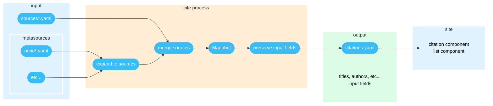

# Citations

Arguably the most important feature of this template is its ability to automatically generate citations from simple identifiers. This makes it easy to cite and maintain large lists of publications.

The template is able to do this thanks to [Manubot](https://github.com/manubot/manubot#cite)**,** a suite of tools that (among many other things) lets you automatically generate a citation with full details from just a short identifier, like `doi`, `url`, `isbn`, `pmc`, `pmcid`, `pubmed`, `arxiv`, and [many many more](https://github.com/manubot/manubot/blob/main/manubot/cite/handlers.py#L155).



## How it works

First let's define some consistent terminology to make things easier to explain:

* **source** - A paper, book, article, web page, film, or any other published item you want to cite.
* **metasource** - A single item that lists multiple sources, like how an author's [ORCID number](https://orcid.org/) can be used to get a list of their published works.
* **citation** - Full, detailed information about a source, like title, author(s), publisher, publish date, URL,  etc.

For most content on your site, you just need change the contents of the appropriate file. Citations have a special additional step. When you add new sources or metasources to be cited, the template has to run a special "cite process" to generate your full citations.

At a high level, here's how it all works:



1. Input your sources and metasources in `/_data` files, e.g. `sources-2020.yaml`, `orcid-students.yaml`, etc.
2. The **cite process** runs – either [on GitHub](../getting-started/preview-your-site.md#on-github-remotely) or [locally](../getting-started/preview-your-site.md#on-your-computer-locally) – to convert your sources and metasources to full citations.
3. The cite process outputs a single `citations.yaml` file in `/_data`.
4. Display and filter citations on your site with the [list](components/list.md) and [citation](components/citation.md) components.


Do not edit `citations.yaml`! It will get overwritten each time the cite process runs. If you need to manually input or correct things, see below.


<details>

<summary>The cite process in detail...</summary>

1. Each source/metasource file gets processed by the appropriate cite plugin (see `/_cite/plugins`) based on filename prefix.
2. In metasource files, each list entry gets expanded into a list of regular sources. Any fields you put in the original entry get copied to each source in the expanded list.
3. In source files, each list entry stays as-is.
4. Metadata about the cite process is attached to each source, like which input file it originated from and which cite plugin it ran with.
5. A full list of regular sources is compiled, with duplicates merged together by `id`.
6. Manubot generates full citation details for each source that has an `id`.
7. Any field originally on each source is preserved.

</details>

You can mix and match as many sources and metasources as you want, and display them however and wherever you'd like! For example, you may want to have a "CV" page that lists all of the papers under your [PI](https://en.wikipedia.org/wiki/Principal\_investigator)'s ORCID, then reserve your "Research" page for just a few special papers by various members in your lab that you want to highlight.

## Examples

### Basic id

**Filename must start with `sources`.**


```yaml
- id: doi:10.1098/rsif.2017.0387
- id: pubmed:29424689
- id: pmc:PMC5640425
- id: arxiv:1806.05726
# ...more sources
```


<table><thead><tr><th width="140">Parameter</th><th>Description</th></tr></thead><tbody><tr><td><code>id</code></td><td>Identifier for the source that <a href="https://github.com/manubot/manubot/blob/main/manubot/cite/handlers.py#L155">Manubot can understand and cite</a>. If Manubot is unable to generate a citation for this ID, the template will log an error message and exit with an error code.</td></tr></tbody></table>

### Rich details

Optionally, you can manually pass extra "rich" details that the template can display nicely. Manubot can't automatically determine these.


```yaml
- id: arxiv:1806.05726
  type: paper
  description: Lorem ipsum _dolor sit amet_.
  image: https://publisher.com/striking-image-for-your-paper.jpg
  buttons:
    - type: source
      link: https://github.com/your-lab/some-repo
    - type: website
      text: My Personal Website
      link: http://some-website.com/
  tags:
    - biology
    - big data
    - medicine
  repo: your-lab/some-repo

# ...another source
```


<table><thead><tr><th width="205">Parameter</th><th>Description</th></tr></thead><tbody><tr><td><code>type</code></td><td>The type of the source. Determines the icon to show.<br><br>See <code>/_data/types.yaml</code> for what types are built-in or to add your own.</td></tr><tr><td><code>description</code></td><td>Brief description of the source. Can contain Markdown.</td></tr><tr><td><code>image</code></td><td>URL to a striking image for the source. Highly recommended. Displays as a thumbnail next to the citation details.</td></tr><tr><td><code>buttons</code></td><td>List of <a href="components/button.md">buttons</a> to show underneath the citation details.</td></tr><tr><td><code>tags</code></td><td>List of <a href="components/tags.md">tags</a> to show underneath the citation details.</td></tr><tr><td><code>repo</code></td><td>GitHub repository to automatically fetch additional <a href="components/tags.md">tags</a> from.</td></tr></tbody></table>


Always provide a good thumbnail for your publications. Use a figure from the source, or if there are none, a journal logo or issue cover. [Here are some best practices for making a good thumbnail image](https://github.com/manubot/catalog#thumbnail-guidelines).


### Manual override

All fields you attach to a source (or metasource, see below) get passed through to the generated citation untouched. This allows you to manually input or correct details of a citation.&#x20;


```yaml
# manually correct specific citation detail
- id: pmc:PMC5640425
  publisher: Cold Spring Harbor

# manually provide all citation details
- title: Some Publication Title
  authors:
    - Steve McQueen
    - Lightning McQueen
  publisher: bioRxiv
  date: 2021-01-01
  link: biorxiv.org/1234

# attach an arbitrary field
- id: pmc:PMC5640425
  some-field: 123
```


<table><thead><tr><th width="208">Parameter</th><th>Description</th></tr></thead><tbody><tr><td><code>title</code> / <code>authors</code> / <code>publisher</code> / <code>date</code> / <code>link</code></td><td>Basic citation information normally returned from Manubot and displayed by the <a href="components/citation.md">citation</a> component. Date should be in <code>YYYY-MM-DD</code> format.</td></tr></tbody></table>

If you don't provide an `id`, Manubot has nothing to cite and so doesn't run. You'd only want to do this if manually providing all the citation details manually. This defeats the main benefit of the template, but is sometimes necessary.

You can also attach arbitrary fields. The template won't explicitly use them, but you could use them to filter citations with the [list](components/list.md) component.

### ORCID

[ORCID](https://orcid.org/) is the recommended way to retrieve a complete set of published works for an author.

**Filename must start with `orcid`.**


```yaml
- orcid: 0000-0002-4655-3773
  some-field: 123

# ...another author
```


Each ORCID gets expanded into a full list of regular sources with `id`s. Any fields you put in the original entry get copied to each source in the expanded list. This applies to the other types of metasources below as well.

Because the cite process merges duplicate sources by `id`, you can also use the [manual override method](citations.md#manual-override) above to manually correct sources returned from metasources. Example:


```yaml
# some paper returned by an ORCID with a wrong title
- id: doi:123/456
  title: Correct Title
```


### PubMed

Uses [NCBI eutils](https://www.ncbi.nlm.nih.gov/books/NBK25500/) to search [PubMed](https://pubmed.ncbi.nlm.nih.gov/) for terms. This is a brittle way to select an author's papers, very vulnerable to false positives. ORCID is recommended.

**Filename must start with `pubmed`.**


```yaml
- term: "Greene, C[Author] NOT Greene CE[Author]"
  some-field: 123
```


### Google Scholar

Unfortunately, Google does not provide APIs for many of its services, and that includes Scholar. Luckily there is a 3rd-party API to access it, [SerpAPI](https://serpapi.com/). First you'll have to sign up and get an API key. Then, if [running the cite process on GitHub](../getting-started/preview-your-site.md#on-github-remotely), make a [new repository secret](https://docs.github.com/en/actions/security-guides/encrypted-secrets#creating-encrypted-secrets-for-a-repository) named `GOOGLE_SCHOLAR_API_KEY` with your API key as its value, or if [running locally](../getting-started/preview-your-site.md#on-your-computer-locally), put the same name/value in a `.env` file.

**Filename must start with `google-scholar`.**


```yaml
- gsid: ETJoidYAAAAJ
  some-field: 123
```


## Periodic updates

Metasources like ORCID update over time as you publish new sources. As such, the template periodically re-runs the cite process without provocation. This will get the latest sources associated with your metasources, generate citations like normal, and open a pull request to let you review the changes before publishing them.

## Cache

If you have many sources, generating the citations for all of them can take a while. To save time, the cite process keeps a time-to-live cache for Manubot/ORCID/etc. network requests. If a cached response hasn't expired, it is used instead of making a new request. To clear this, simply delete the cache file in `_cite`. You can also customize the default expire times in the Python code in `_cite`.
